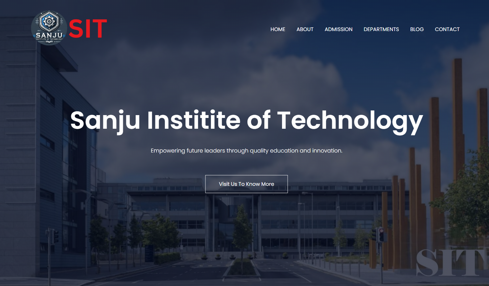
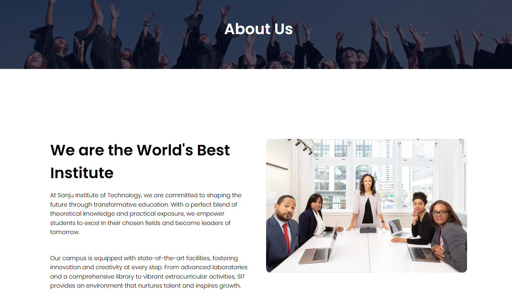
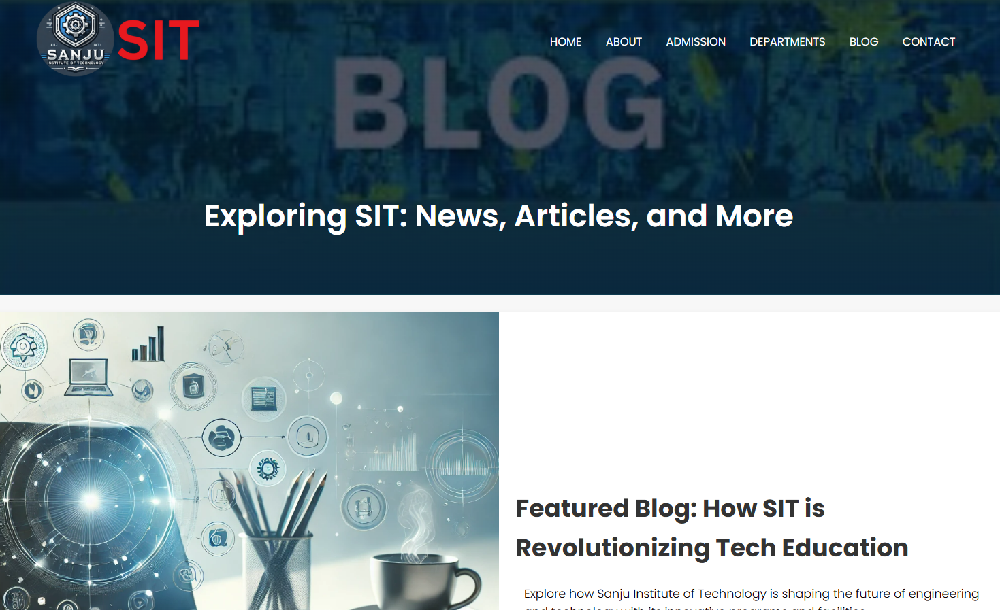
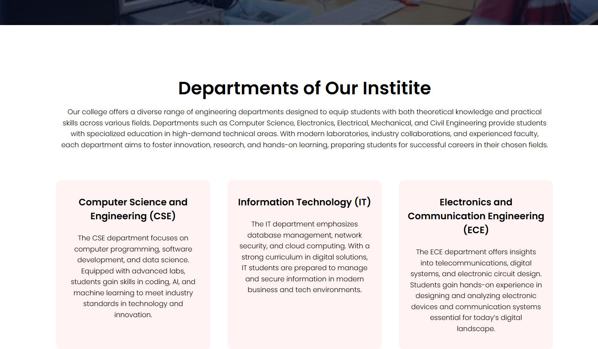

#  Sanju Institute of Technology (SIT) - This is the college mini project website

Welcome to the official website project for **Sanju Institute of Technology (SIT)**, a modern, responsive, and user-friendly college website built using HTML, CSS, and JavaScript. This project serves as an academic mini-project aimed at showcasing web development skills and institutional representation online.

---

##  Project Overview
The SIT website is designed to:

- Provide a digital presence for the college.
- Share information about courses, departments, admissions, and campus life.
- Serve as an informative hub for students, parents, and faculty.
- Showcase campus facilities and student testimonials.

---

##  Features
-  Responsive design across devices.
-  Clean and modern UI/UX.
-  Intuitive navigation bar.
-  Sections for About, Admission, Departments, Blog, Contact.
-  Testimonials from students.
-  Social media integration.
-  Contact form and feedback section.
-  JavaScript-based responsive menu.

---

##  Technologies Used
- **HTML5** – Page structure
- **CSS3** – Styling and layout
- **JavaScript** – Interactivity (menu toggle)
- **Google Fonts** – Custom fonts
- **Font Awesome** – Icons
- **Responsive Design Principles**

---

##  Pages Included
- `index.html` – Home page
- `about.html` – About the institution
- `admission.html` – Admission process
- `departments.html` – Departments offered
- `blog.html` – College blog section
- `contact.html` – Contact us page

---

##  Project Structure
```
SIT-Website-Project/
│
├── index.html                # Homepage
├── about.html                # About page
├── admission.html            # Admission page
├── departments.html          # Departments page
├── blog.html                 # Blog page
├── contact.html              # Contact page
│
├── style.css                 # Main stylesheet
├── script.js                 # JavaScript for interactivity (if separated)
│
├── README.md                 # Project description & instructions
├── LICENSE                   # Optional: license for open-source
│
├── /images/                 # All image assets
│   ├── logo1.png
│   ├── logo11.png
│   ├── user1.jpg
│   ├── user2.jpg
│   ├── london.jpg
│   ├── newyork.jpg
│   └── ...
│
└── /assets/                 # Optional: fonts, additional media
    └── ...

```


---

##  Preview
##  Screenshots

###  Homepage


###  Contact Page


###  About Page


###  Blog Page


###  Admission Page


###  Departments Page


---

##  Acknowledgements

- Developed by **Sanjeev Kumar**
- Special thanks to open-source libraries and icons from:
  - [Font Awesome](https://fontawesome.com/)
  - [Google Fonts](https://fonts.google.com/)

---

##  What I Learned

- How to structure and style multi-page websites
- Using external libraries (icons, fonts)
- Making sites responsive and accessible
- Understanding UI/UX principles
- Creating semantic and organized codebases

---

## Feature which you can add in this

- You can add more JS files to make it more functioning.
- You can also free to add the new pages.
- You can also add some more responsive and functionalities.


##  Contact
**Developer:** Sanjeev Kumar  
**College:** Sanju Institute of Technology (SIT)  
**GitHub:** [Check](https://github.com/Sanju-1114)

**Live Demo:** [Click here](https://sanju-1114.github.io/college-website/index.html)

---


